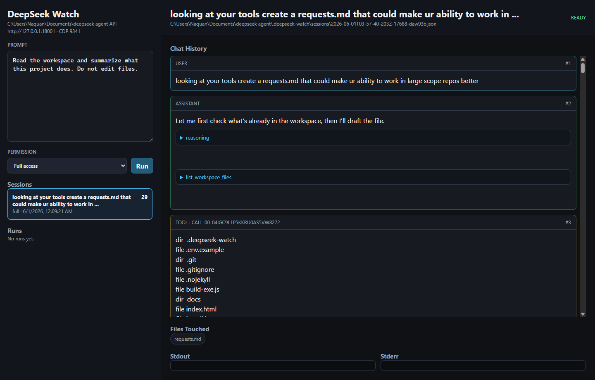
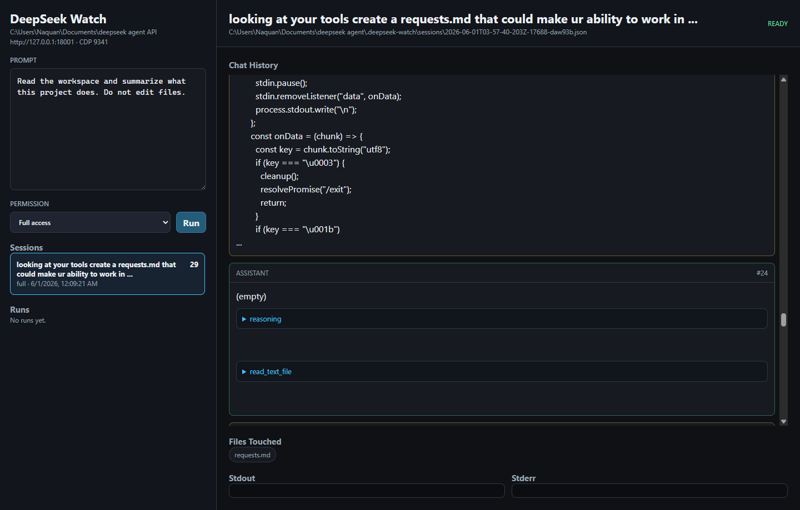

# dsw — DeepSeek Watch

> Interactive DeepSeek coding agent for the terminal. Streams thinking, calls tools, reads and edits files, runs shell commands — with session memory and permission controls.

[](https://nodejs.org)
[](LICENSE)
[]()

---

## Features

- **Extended thinking** — streams DeepSeek's reasoning chain live as it works
- **File tools** — read by line range, write new files, patch existing ones
- **Web search** — search current external information from the agent loop
- **Shell tools** — run `cmd.exe` and PowerShell with per-session permission controls
- **Session memory** — every conversation is saved; resume any previous session
- **Electron UI** — launch `d -ui` for a desktop chat surface with a local control API and CDP port
- **Unlimited tool turns** — no cap on how many tool-call loops it can make
- **Detached mode** — fire a prompt in the background and poll for the output file
- **Claude fallback** — `dsd` falls back to `claude -p` if DeepSeek is unavailable
- **Dependency-light CLI** — core agent tools use built-in Node APIs; Electron is used only for `d -ui`
- **OpenAI-compatible** — point at any compatible endpoint via `--base-url`

---

## Install

### Windows — one-liner

```powershell
irm https://raw.githubusercontent.com/gaston1799/deepseek-detached-agent/main/install.ps1 | iex
```

Or download [`install.bat`](install.bat) and double-click it.

The installer checks for **Git** and **Node.js ≥ 18**, installs any missing deps via `winget`, refreshes `PATH`, clones the repo, then runs `npm install -g`.

### Manual

```bash
git clone https://github.com/gaston1799/deepseek-detached-agent
cd deepseek-detached-agent
npm install -g .
```

---

## Quick start

```bash
# Save your API key once
dsw config set-key sk-xxxxxxxxxxxxxxxx

# Ask a question
dsw -p "explain this codebase"

# Open the TUI dashboard (no args)
dsw

# Open the Electron desktop UI
d -ui

# Resume a previous session
dsw --resume
```

---

## Commands

| Command | Alias | Description |
|---------|-------|-------------|
| `dsw` | `d` | Interactive agent — streams thinking, calls tools, saves sessions |
| `dsw -ui` | `d -ui` | Electron desktop UI with HTTP control API and CDP debugging port |
| `dsd` | — | Fire-and-forget: prompt → Markdown file, optional Claude fallback |
| `dswait` | — | Poll until a detached output file appears |

---

## Permission levels

| Level | What DeepSeek can do |
|-------|----------------------|
| `review` | Read files and list directories only |
| `ask` *(default)* | Same + prompts before writing files or running shell commands |
| `full` | All tools run automatically without prompting |

```bash
dsw --permission review -p "audit the auth module"
dsw --permission full   -p "refactor utils.js to use ES modules"
```

---

## Desktop UI

Launch the Electron UI instead of the terminal dashboard:

```bash
d -ui
```

Useful options:

```bash
d -ui --ui-port 17891 --ui-cdp-port 9223
```

- UI control API: `http://127.0.0.1:17891`
- CDP / remote debugging: `http://127.0.0.1:9223`
- Health check: `GET /health`
- List saved sessions: `GET /sessions`
- Read a saved session: `GET /sessions/<url-encoded-session-path>`
- Start a run: `POST /chat` with `{"prompt":"...","permission":"review"}` or `{"permission":"full"}`
- Resume a session from the API: include `{"sessionPath":"C:\\path\\to\\session.json"}` in `POST /chat`
- Inspect runs: `GET /runs` and `GET /runs/<id>`

The UI delegates chat execution back to the existing `d` CLI, reads the same `.deepseek-watch/sessions/*.json` files as the TUI, renders chat history/tool calls/tool results, and writes per-run output under `.deepseek-watch/ui/<run-id>/`.





---

## Workspace tools

In terminals that support OSC-8 hyperlinks, the TUI turns exact workspace file paths shown in tool calls/results into clickable file links. Set `DEEPSEEK_NO_FILE_LINKS=1` to disable terminal file links.

### Read-only (all permission levels)

| Tool | Description |
|------|-------------|
| `get_runtime_context` | OS, shell, Node version, git branch, date |
| `list_workspace_files` | List files/dirs — now supports `recursive`, `glob`, `exclude_glob`, `include_metadata`, pagination |
| `read_text_file` | Read a file by line range or byte offset; `structured: true` returns cursor JSON |
| `read_text_files` | Batch-read multiple files in one call; per-file errors don't abort the batch |
| `view_image` | Read a workspace image and return metadata, dimensions, and a data URL when small enough; does not visually interpret content |
| `analyze_image_openai` | Use OpenAI vision to inspect/transcribe a workspace image; requires `OPENAI_API_KEY` |
| `search_code` | Regex/literal search across workspace files with glob filter and context lines |
| `glob` | Discover paths matching a glob pattern (no shell) |
| `stat_file` | Size, modification time, type, and binary flag for any path |
| `path_exists` | Check whether a path exists |
| `is_text_file` | Sniff whether a file is text or binary |
| `get_related_files` | Scan import/require/include statements to find referenced files |
| `tree` | Visual directory tree output |
| `git_status` | `git status --short --branch` |
| `git_diff` | Staged or unstaged diff, optionally vs a branch |
| `git_log` | Commit log (one-line format) |
| `git_blame` | Line-range blame |
| `cache_set` / `cache_get` | Session key-value store persisted with saved session files |
| `list_skills` / `read_skill` | Discover and read local skills from configured skill roots |
| `create_goal` / `get_goal` / `update_goal` | Persistent session goal state for long-running work |
| `update_plan` / `get_plan` | Persistent visible plan steps with statuses |
| `session_health` | Session integrity, progress, touched files, and repair-needs summary |
| `checkpoint_session` | Append a compact checkpoint to the saved session |
| `summarize_session` | Compact recent session summary |
| `handoff_status` / `handoff_wait` | Inspect or wait for delegated handoff output files |
| `web_search` | Web search via Brave (with `BRAVE_SEARCH_API_KEY`) or DuckDuckGo HTML/Lite |
| `web_fetch` | Fetch a URL and return readable page text with chunk offsets |

### Write tools (ask, full)

| Tool | Description |
|------|-------------|
| `write_text_file` | Create or overwrite a file |
| `patch_files` | Atomic multi-file patch — all `old_string` values must match before any file is written |
| `patch_text_file` | Single-file exact search-and-replace |
| `run_cmd` | Run a `cmd.exe` command |
| `run_powershell` | Run a PowerShell command |
| `functions_shell_command` | PowerShell with optional workspace-relative `workdir` |
| `handoff_start` | Start a bounded delegated CLI handoff with prompt, output, and log files |

### Reading by line range

DeepSeek can target specific lines without loading the whole file:

```
read lines 40–80 of src/auth.js
```

Internally: `read_text_file { "path": "src/auth.js", "start_line": 40, "end_line": 80 }`

### Searching across files

```
search_code { "pattern": "TODO", "glob": "**/*.ts", "context_lines": 2 }
```

### Atomic multi-file patching

`patch_files` preflights all `old_string` values first — if any don't match, no files are written:

```json
{
  "edits": [
    { "path": "src/a.ts", "old_string": "foo", "new_string": "bar" },
    { "path": "src/b.ts", "old_string": "baz", "new_string": "qux" }
  ]
}
```

---

## dsw options

```
  -p, --prompt <text>              Prompt text
  --prompt-file <file>             Read prompt from file
  --stdin                          Read prompt from stdin
  --system <text>                  Override system prompt
  --system-file <file>             System prompt file (default: prompts/default-system.md)
  --print-system                   Print rendered system prompt and exit
  --skill <name-or-path>           Load a local skill's SKILL.md into the system prompt; repeatable
  --skills <a,b>                   Comma-separated skills to load
  --skill-root <dir>               Directory containing skill folders; repeatable
  --list-skills                    List discovered local skills and exit
  --model <name>                   Model (default: deepseek-v4-flash)
  --base-url <url>                 OpenAI-compatible base URL (default: https://api.deepseek.com)
  --effort <high|max>              Reasoning effort (default: high)
  --thinking <enabled|disabled>    Thinking toggle (default: enabled)
  --max-tokens <n>                 Max output tokens (default: 8192)
  --timeout <ms>                   Per-turn timeout ms (default: 600000)
  --max-tool-turns <n>             Cap tool-call loops (default: unlimited)
  --tool-mode <parallel|sequential>
                                   parallel = concurrent tool calls (default)
                                   sequential = run in order
  --permission <review|ask|full>   Session permission level
  --session <file>                 Session JSON file
  --resume                         Resume from --session or pick from list
  --no-save-session                Don't persist session to disk
  -o, --output <file>              Write a Markdown result file
  --outfile <file>                 Alias for --output
  --no-output                      Suppress terminal output; requires --output/--outfile
  --full-chat                      Write full transcript instead of final answer + touched files
  --dangerously-auto-run-commands  Auto-approve all commands and file writes
  --no-tools                       Disable all workspace tools
  --no-color                       Disable ANSI colors
  -h, --help                       Show help
```

### Doctor

Run a local readiness check:

```powershell
d doctor
```

Doctor reports DeepSeek key status, OpenAI vision status, selected vision model, CLI availability, and discovered skills. It does not print full API keys.

### Local skills

`dsw` can load Codex-style local skills by appending their `SKILL.md` files to the system prompt:

```powershell
dsw -p "use PBC to inspect the page" --skill pbc --permission full
```

Skill discovery checks, in order:

- directories passed with `--skill-root`
- directories from `DEEPSEEK_SKILLS_DIR` (path-delimited)
- `.deepseek-watch/skills` in the current workspace
- `~/.codex/skills`, including Codex hidden grouping folders such as `.system`

Use `--list-skills` to see discovered skills. During a session, DeepSeek can also call `list_skills` and `read_skill` to inspect skills that were not preloaded.

When you resume with a skill, the wrapper refreshes the saved system message and persists the skill list in the session JSON:

```powershell
dsw --resume --skill pbc -p "continue"
```

Future resumes of that session reuse the saved skills automatically unless you pass a different `--skill` / `--skills` set.

### Image understanding

`view_image` only exposes image metadata and a data URL. For real visual understanding, set an OpenAI key and let DeepSeek call `analyze_image_openai`:

```powershell
$env:OPENAI_API_KEY = "sk-..."
d -p "read the code in screenshot.png" --permission review
```

To persist the OpenAI key for future terminals on Windows:

```powershell
d config set-openai-key sk-proj-your-full-key
```

This writes `OPENAI_API_KEY` to your Windows user environment. Open a new terminal after running it.

Use `OPENAI_VISION_MODEL` to override the default OpenAI vision model:

```powershell
$env:OPENAI_VISION_MODEL = "gpt-4.1-mini"
```

Quiet outfile mode is meant for detached subagent workflows where console text costs tokens:

```bash
dsw -p "inspect this repo and write findings" --permission full --no-output --outfile result.md
```

By default the Markdown file contains only the final assistant response and files touched by edit tools. Add `--full-chat` when you want the whole conversation, tool calls, tool results, and reasoning transcript written to the outfile.

---

## dsd — detached runner

```bash
# Foreground — writes result to out.md when done
dsd -p "summarise the last 10 commits" -o out.md

# Background — exits immediately, worker runs detached
dsd -p "..." -o out.md --detach
dswait out.md --timeout 120000   # wait up to 2 min
```

```
  -p, --prompt <text>
  --prompt-file <file>
  --stdin
  -o, --output <file>         Output Markdown file (default: deepseek-result.md)
  --model / --base-url / --effort / --thinking / --max-tokens / --timeout
  --detach                    Spawn background worker and exit
  --no-fallback               Don't fall back to claude -p on error
  --claude-cmd <cmd>          Claude CLI path (default: CLAUDE_CMD or claude)
```

---

## Configuration

```bash
dsw config set-key <key>   # save to %APPDATA%\deepseek-detached-agent\config.json
dsw config path            # show config file location
```

Environment variables (take priority over saved config):

```env
DEEPSEEK_API_KEY=sk-...
DEEPSEEK_MODEL=deepseek-v4-flash
DEEPSEEK_BASE_URL=https://api.deepseek.com
CLAUDE_CMD=claude
NO_COLOR=1
```

---

## Session memory

Sessions are saved to `.deepseek-watch/sessions/` in the working directory.

```bash
dsw --resume                        # arrow-key picker, sorted by last used
dsw --session path/to/session.json  # explicit file
dsw --no-save-session               # ephemeral — nothing written
```

---

## Troubleshooting

| Error | Cause | Fix |
|-------|-------|-----|
| `HTTP 401: Authentication Fails` | Invalid API key | `dsw config set-key sk-...` |
| `HTTP 402: Insufficient Balance` | Account needs credit | Top up on DeepSeek Platform |
| `No DeepSeek API key found` | No key set | Set `DEEPSEEK_API_KEY` or run `dsw config set-key` |

---

## License

MIT © 2026 [gaston1799](https://github.com/gaston1799)
