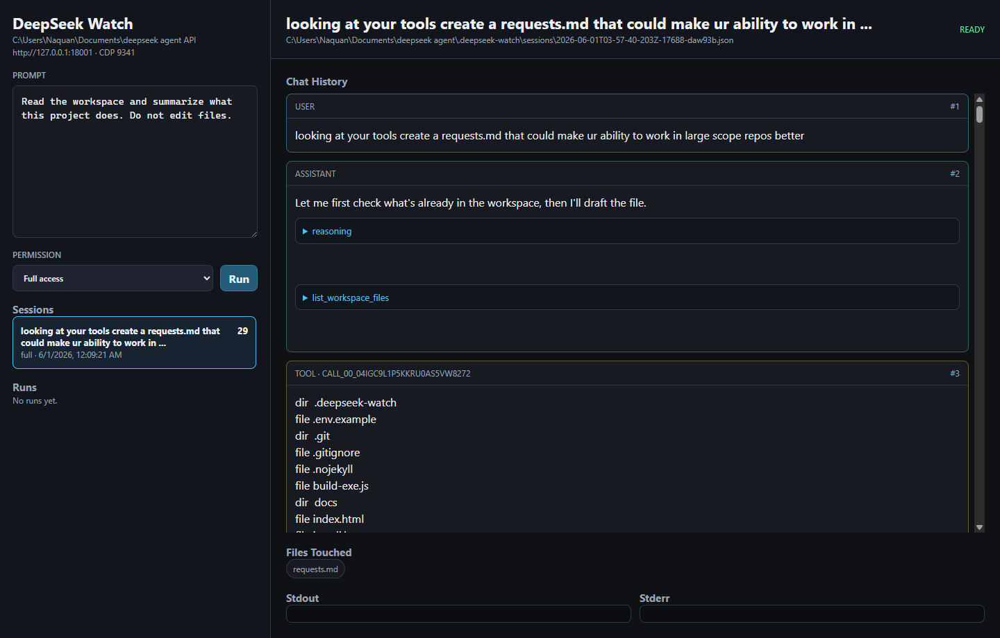
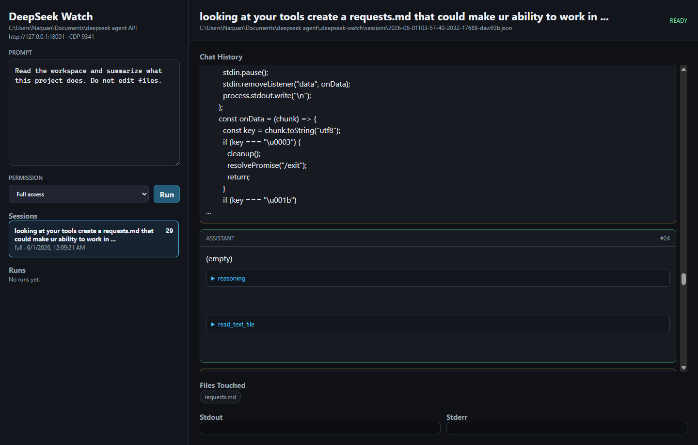

# dsw — DeepSeek Watch

> Interactive DeepSeek coding agent for the terminal. Streams thinking, calls tools, reads and edits files, runs shell commands — with session memory and permission controls.

[](https://nodejs.org)
[](LICENSE)
[]()

---

## Features

- **Extended thinking** — streams DeepSeek's reasoning chain live as it works
- **File tools** — read by line range, write new files, patch existing ones
- **Web search** — search current external information from the agent loop
- **Shell tools** — run `cmd.exe` and PowerShell with per-session permission controls
- **Session memory** — every conversation is saved; resume any previous session
- **Multi-agent coordination** — stable IDs, durable peer messages, task claims, handoffs, and parked wait/wake sessions
- **Electron UI** — launch `d -ui` for a desktop chat surface with a local control API and CDP port
- **Unlimited tool turns** — no cap on how many tool-call loops it can make
- **Detached mode** — fire a prompt in the background and poll for the output file
- **Claude fallback** — `dsd` falls back to `claude -p` if DeepSeek is unavailable
- **Dependency-light CLI** — core agent tools use built-in Node APIs; Electron is used only for `d -ui`
- **OpenAI-compatible** — point at any compatible endpoint via `--base-url`
- **GLM support** — use Z.AI's OpenAI-compatible GLM API with `--provider glm`
- **Dynamic auto context compaction** — at the default 90% trigger, the wrapper follows the selected provider/model context window (GLM-4.7: 200K; older GLM-4.5/GLM-4-32B variants: 128K; DeepSeek v4: 1,048,576) and reserves the configured completion budget; use `--compact-limit <tokens>` for a custom endpoint/model

---

## Context compaction

Long agent sessions grow the transcript until the API rejects the request at
the model's context ceiling (for DeepSeek v4-class models: **1,048,576 tokens
total = messages + completion**). `dsw` detects this *before* the request is
sent and compacts:

- **Detection** — before every model call the wrapper estimates the messages
  budget (`limit − max_tokens`, chars/4 × 1.2 safety factor) and triggers at
  `--compact-at` (default `0.9`) of that budget.
- **What survives** — the system prompt, one `<context_compaction>` summary
  message, and the recent tail verbatim (default 40 messages, capped at ~10%
  of the window) so `tool_call_id`s stay consistent.
- **Methods** — `--compact-method auto` (default: DeepSeek LLM summary, falls
  back to a deterministic roll-up of goal/plan/checkpoints if the API call
  fails), `llm`, `truncate` (no API call, free), `detached` (spawn
  `scripts/compact-session.mjs` in a subprocess), or `off`.
- **Audit** — every compaction is appended to `session.compactions[]` with
  `from_tokens`/`to_tokens`/method and printed as a ⚠ status line.

CLI flags: `--compact-at <pct>` (default 0.9), `--compact-method <auto|llm|truncate|detached|off>`,
`--compact-limit <tokens|auto>` (default `auto`), `--compact-keep-recent <n>` (default 40), `--no-compact`.
Environment equivalents: `DEEPSEEK_COMPACT_AT`, `DEEPSEEK_COMPACT_METHOD`, `DEEPSEEK_CONTEXT_LIMIT`,
`DEEPSEEK_COMPACT_KEEP_RECENT`.

To compact an existing session file manually (or from another agent):

```bash
node scripts/compact-session.mjs .deepseek-watch/sessions/<file>.json --method truncate
```

**Coordination-level compaction** — agents get two extra tools:
- `compact_session` — an agent compacts *its own* session on demand (`force: true` even below the auto threshold).
- `agent_compact <agent_id>` — the coordinator (or any agent) compacts another agent: if the target is **live** it receives an inbox `compact` request it applies mechanically on its next wake/turn and replies with the result (deterministic, no LLM involvement in the mechanics); if the target is **stopped/failed** its session file is compacted directly (with a `.compact-bak`) so its next launch resumes compacted.

---

## Install

### Windows — one-liner

```powershell
irm https://raw.githubusercontent.com/gaston1799/deepseek-detached-agent/main/install.ps1 | iex
```

Or download [`install.bat`](install.bat) and double-click it.

The installer checks for **Git** and **Node.js ≥ 18**, installs any missing deps via `winget`, refreshes `PATH`, clones the repo, then runs `npm install -g`.

### Manual

```bash
git clone https://github.com/gaston1799/deepseek-detached-agent
cd deepseek-detached-agent
npm install -g .
```

---

## Quick start

```bash
# Save your API key once
dsw config set-key sk-xxxxxxxxxxxxxxxx

# Ask a question
dsw -p "explain this codebase"

# Open the TUI dashboard (no args)
dsw

# Open the Electron desktop UI
d -ui

# Resume a previous session
dsw --resume
```

---

## Commands

| Command | Alias | Description |
|---------|-------|-------------|
| `dsw` | `d` | Interactive agent — streams thinking, calls tools, saves sessions |
| `dsw -ui` | `d -ui` | Electron desktop UI with HTTP control API and CDP debugging port |
| `dsd` | — | Fire-and-forget: prompt → Markdown file, optional Claude fallback |
| `dswait` | — | Poll until a detached output file appears |

---

## Permission levels

| Level | What DeepSeek can do |
|-------|----------------------|
| `review` | Read files and list directories only |
| `ask` *(default)* | Same + prompts before writing files or running shell commands |
| `full` | All tools run automatically without prompting |

```bash
dsw --permission review -p "audit the auth module"
dsw --permission full   -p "refactor utils.js to use ES modules"
```

### Unattended, scoped work

For an authorized task that may run unattended, seed the task scope at launch and use full permission:

```powershell
dsw --provider glm --permission full --allow-target example.com,api.example.com --agent-id recon
```

Repeat `--allow-target` for additional authorized assets, or comma-separate them. While a session is running, the agent can use `scope_add_assets` or `scope_remove_assets`; no replacement agent is needed. For a complete policy, use `--scope-file scope.json`; it accepts the same `allowed_assets`, `excluded_assets`, `allowed_classes`, `excluded_classes`, and `restrictions` fields as `scope_set`.

For HackerOne work, give the coordinator a target first. It should use the existing signed-in PBC profile for a cheap viability pass, record `CONTINUE`, `ESCALATE`, or `DROP`, and only then wake deeper workers.

---

## Desktop UI

Launch the Electron UI instead of the terminal dashboard:

```bash
d -ui
```

Useful options:

```bash
d -ui --ui-port 17891 --ui-cdp-port 9223
```

- UI control API: `http://127.0.0.1:17891`
- CDP / remote debugging: `http://127.0.0.1:9223`
- Health check: `GET /health`
- List saved sessions: `GET /sessions`
- Read a saved session: `GET /sessions/<url-encoded-session-path>`
- Start a run: `POST /chat` with `{"prompt":"...","permission":"review"}` or `{"permission":"full"}`
- Resume a session from the API: include `{"sessionPath":"C:\\path\\to\\session.json"}` in `POST /chat`
- Inspect runs: `GET /runs` and `GET /runs/<id>`

The UI delegates chat execution back to the existing `d` CLI, reads the same `.deepseek-watch/sessions/*.json` files as the TUI, renders chat history/tool calls/tool results, and writes per-run output under `.deepseek-watch/ui/<run-id>/`.





---

## Workspace tools

In terminals that support OSC-8 hyperlinks, the TUI turns exact workspace file paths shown in tool calls/results into clickable file links. Set `DEEPSEEK_NO_FILE_LINKS=1` to disable terminal file links.

### Read-only (all permission levels)

| Tool | Description |
|------|-------------|
| `get_runtime_context` | OS, shell, Node version, git branch, date |
| `list_workspace_files` | List files/dirs — now supports `recursive`, `glob`, `exclude_glob`, `include_metadata`, pagination |
| `read_text_file` | Read a file by line range or byte offset; `structured: true` returns cursor JSON |
| `read_text_files` | Batch-read multiple files in one call; per-file errors don't abort the batch |
| `view_image` | Read a workspace image and return metadata, dimensions, and a data URL when small enough; does not visually interpret content |
| `analyze_image_openai` | Use OpenAI vision to inspect/transcribe a workspace image; requires `OPENAI_API_KEY` |
| `search_code` | Regex/literal search across workspace files with glob filter and context lines |
| `artifact_list` / `artifact_read_range` / `artifact_search` | Bounded retrieval from task-scoped analysis artifacts |
| `artifact_index` / `artifact_search_all` | Task-wide artifact metadata and bounded cross-artifact search |
| `sandbox_execute` / `sandbox_manage` | Bounded Docker execution using named ephemeral environments |
| `scope_get` / `scope_set` / `scope_check` | Structured task authorization state and target checks |
| `hypothesis_record` / `viability_set` / `roi_record` | Persist negative findings, viability decisions, and task economics |
| `net_capture_start` / `net_capture_stop` / `net_capture_status` | Bounded ring-buffer capture in the isolated network environment |
| `model_escalation_get` / `model_escalation_set` / `model_escalation_decide` | Configurable cheap/specialist/verifier routing |
| `glob` | Discover paths matching a glob pattern (no shell) |
| `stat_file` | Size, modification time, type, and binary flag for any path |
| `path_exists` | Check whether a path exists |
| `is_text_file` | Sniff whether a file is text or binary |
| `get_related_files` | Scan import/require/include statements to find referenced files |
| `tree` | Visual directory tree output |
| `git_status` | `git status --short --branch` |
| `git_diff` | Staged or unstaged diff, optionally vs a branch |
| `git_log` | Commit log (one-line format) |
| `git_blame` | Line-range blame |
| `cache_set` / `cache_get` | Session key-value store persisted with saved session files |
| `list_skills` / `read_skill` | Discover and read local skills from configured skill roots |
| `create_goal` / `get_goal` / `update_goal` | Persistent session goal state for long-running work |
| `update_plan` / `get_plan` | Persistent visible plan steps with statuses |
| `session_health` | Session integrity, progress, touched files, and repair-needs summary |
| `checkpoint_session` | Append a compact checkpoint to the saved session |
| `summarize_session` | Compact recent session summary |
| `handoff_status` / `handoff_wait` | Inspect or wait for delegated handoff output files |
| `web_search` | Web search via Google Custom Search when configured, then Brave, then DuckDuckGo HTML/Lite |
| `web_fetch` | Fetch a URL and return readable page text with chunk offsets |
| `web_find` | Fetch a URL and run a JavaScript regexp over readable page text |
| `classify_url` | Check an unfamiliar URL for known scam, tracker, wall, executable, and shortener signatures without opening it |
| `verify_download` | Quarantine and statically inspect a permitted local file or non-flagged URL; never executes it |
| `watch_downloads` | List recent Downloads files and identify `.crdownload` files still in progress |
| `file_watch` | Compare workspace file snapshots and report created, modified, and deleted files |
| `project_memory` | Durable workspace conventions/decisions in `.deepseek-watch/project-memory.json` (never secrets) |
| `track_bypass_state` | Persist defensive research state such as suspicious domains and verified hashes |
| `scan_download_hash` / `virus_total` | Optional VirusTotal lookup when `VT_API_KEY` is configured |
| `whois_lookup` / `dns_lookup` / `cert_logs` | Read-only domain registration, DNS, and Certificate Transparency reconnaissance |
| `file_analyze` | Static file inspection: SHA-256, entropy, printable strings, and basic PE heuristics |
| `semantic_search` | Rank workspace text files by local lexical relevance to a natural-language query |
| `plan_review` | Git status/diff summary, whitespace check, and a compact pre-handoff checklist |
| `agent_identity` / `agent_list` | Inspect this agent and discover live peers, roles, missions, and workspaces |
| `agent_send` / `agent_check_inbox` / `agent_wait` | Durable peer messaging plus safe parked wait/wake behavior |
| `agent_task_create` / `agent_task_list` / `agent_claim` / `agent_handoff` | Coordinator task contracts, atomic ownership leases, and result handoffs |

### Write tools (ask, full)

| Tool | Description |
|------|-------------|
| `write_text_file` | Create or overwrite a file |
| `patch_files` | Atomic multi-file patch — all `old_string` values must match before any file is written; edits to the same file apply in order; CRLF/LF normalized for matching |
| `patch_text_file` | Single-file search-and-replace (first occurrence, or all with `replace_all`); CRLF/LF normalized for matching |
| `run_cmd` | Run a `cmd.exe` command |
| `run_powershell` | Run a PowerShell command |
| `run_bash` | Run a Bash command through `bash.exe` (WSL or Git Bash) |
| `functions_shell_command` | PowerShell with optional workspace-relative `workdir` |
| `handoff_start` | Start a bounded delegated CLI handoff with prompt, output, and log files |
| `process_manage` | Start/stop/status/list named detached processes; records persist in `.deepseek-watch/processes.json` so a later wrapper session can stop them; each process has separate logs and optional HTTP readiness checks |
| `diagnostics` | Run available npm `lint`, `typecheck`, and `check` scripts |
| `run_tests` | Run the workspace npm `test` script when configured |

### Reading by line range

DeepSeek can target specific lines without loading the whole file:

```
read lines 40–80 of src/auth.js
```

Internally: `read_text_file { "path": "src/auth.js", "start_line": 40, "end_line": 80 }`

### Searching across files

```
search_code { "pattern": "TODO", "glob": "**/*.ts", "context_lines": 2 }
```

### Atomic multi-file patching

`patch_files` preflights all `old_string` values first — if any don't match, no files are written:

```json
{
  "edits": [
    { "path": "src/a.ts", "old_string": "foo", "new_string": "bar" },
    { "path": "src/b.ts", "old_string": "baz", "new_string": "qux" }
  ]
}
```

Two properties worth knowing:

- **Multiple edits to the same file apply in order.** Each edit's `old_string` is
  matched against the file content *as modified by the previous edit in the same
  call*, so a multi-hunk edit to one file works in a single call.
- **Line endings are normalized for matching.** On Windows checkouts (CRLF files),
  an `old_string` written with `\n` still matches. Inserted text adopts the file's
  dominant line ending, so a patch never rewrites the whole file's EOL style.
  `patch_text_file` shares the same matching behavior.

### Terminal UI

Interactive sessions render with a Claude Code-style terminal UI (pure ANSI, no
dependencies):

- streaming **markdown-lite** output: headings, bold, inline code, fenced code
  blocks, bullets, numbered lists, task checkboxes, blockquotes, horizontal
  rules, and terminal links for known workspace files
- Claude Code-style **padding + word wrapping**: content is indented 2 columns
  on each side and wraps at word boundaries (never mid-word), re-flowing live
  as the line streams; unbreakable over-long tokens (URLs, code) hard-split
- a live **spinner status line** (model · phase · token count · elapsed time)
  that stays animated during thinking/tool phases and clears before output;
  interactive sessions also set the terminal window title (`dsw · <folder>`)
- compact **tool-call trace**: each call prints `▹ name {args}` when it starts
  and `✓ name (duration)` / `✗ failed` when it finishes, before the result

Everything degrades to plain text when stdout is not a TTY or `--no-color` is
set. For clean terminal copies, use `--tui-quiet` (or
`DEEPSEEK_TUI_QUIET=1`): it disables the status line and in-place line
rewriting, so streamed text never duplicates or leaves status artifacts when
selected/copied mid-run. `npm run test:tui` runs the renderer self-tests.

### Security tooling (allowlisted targets only)Web-app security tools for testing **your own properties** (`dsw security allow
<domain>` registers a target; anything else is refused):

- `sec_http_request` — raw HTTP(S) requests (method/headers/body/redirect control)
- `sec_fuzz_paths` — polite, rate-limited path discovery (wordlists: `small`/`common`)
- `sec_crt_subdomains` — passive cert-transparency subdomain enum + dangling-DNS takeover candidates
- `sec_encode` — base64/hex/url/rot13/SHA1/SHA256/MD5/JWT/XOR workbench
- `sec_extract_iocs` — URLs/IPv4/emails/hashes/domains out of text or files
- `sec_scan_adware` — injected adware/miner/obfuscation/hidden-iframe/popup scanner with a clean/suspicious/infected verdict
- `sec_headers_audit` — security-header scoring (HSTS/CSP/XFO/nosniff/Referrer-Policy), CORS origin-reflection test, cookie flags, version-disclosure notes

Safety model: active tools require the target host in
`~/.deepseek-watch/security-allowlist.json` (managed via
`dsw security allow <domain>` / `remove` / `list`). Requests are rate-limited,
and the tools are request primitives and passive analyzers — no
auto-exploitation or weaponization. `npm run test:security` runs the offline
self-tests.

---

## dsw options

```
  -p, --prompt <text>              Prompt text
  --prompt-file <file>             Read prompt from file
  --stdin                          Read prompt from stdin
  --system <text>                  Override system prompt
  --system-file <file>             System prompt file (default: prompts/default-system.md)
  --print-system                   Print rendered system prompt and exit
  --skill <name-or-path>           Load a local skill's SKILL.md into the system prompt; repeatable
  --skills <a,b>                   Comma-separated skills to load
  --skill-root <dir>               Directory containing skill folders; repeatable
  --list-skills                    List discovered local skills and exit
  --model <name>                   Model (default: deepseek-v4-flash)
  --base-url <url>                 OpenAI-compatible base URL (default: https://api.deepseek.com)
  --effort <high|max>              Reasoning effort (default: high)
  --thinking <enabled|disabled>    Thinking toggle (default: enabled)
  --max-tokens <n>                 Max output tokens (default: 16384)
  --timeout <ms>                   Per-turn timeout ms (default: 600000)
  --max-tool-turns <n>             Cap tool-call loops (default: unlimited); when reached, request a tools-disabled final report instead of discarding the handoff
  --tool-mode <parallel|sequential>
                                   parallel = concurrent tool calls (default)
                                   sequential = run in order
  --permission <review|ask|full>   Session permission level
  --session <file>                 Session JSON file
  --resume                         Resume from --session or pick from list
  --no-save-session                Don't persist session to disk
  -o, --output <file>              Write a Markdown result file
  --outfile <file>                 Alias for --output
  --no-output                      Suppress terminal output; requires --output/--outfile
  --full-chat                      Write full transcript instead of final answer + touched files
  --dangerously-auto-run-commands  Auto-approve all commands and file writes
  --no-tools                       Disable all workspace tools
  --no-color                       Disable ANSI colors
  -h, --help                       Show help
```

### Doctor

Run a local readiness check:

```powershell
d doctor
```

Doctor reports DeepSeek key status, OpenAI vision status, selected vision model, CLI availability, and discovered skills. It does not print full API keys.

### Local skills

`dsw` can load Codex-style local skills by appending their `SKILL.md` files to the system prompt:

```powershell
dsw -p "use PBC to inspect the page" --skill pbc --permission full
```

Skill discovery checks, in order:

- directories passed with `--skill-root`
- directories from `DEEPSEEK_SKILLS_DIR` (path-delimited)
- `.deepseek-watch/skills` in the current workspace
- `~/.codex/skills`, including Codex hidden grouping folders such as `.system`

Use `--list-skills` to see discovered skills. During a session, DeepSeek can also call `list_skills` and `read_skill` to inspect skills that were not preloaded.

When you resume with a skill, the wrapper refreshes the saved system message and persists the skill list in the session JSON:

```powershell
dsw --resume --skill pbc -p "continue"
```

Future resumes of that session reuse the saved skills automatically unless you pass a different `--skill` / `--skills` set.

### Image understanding

`view_image` only exposes image metadata and a data URL. For real visual understanding, set an OpenAI key and let DeepSeek call `analyze_image_openai`:

```powershell
$env:OPENAI_API_KEY = "sk-..."
d -p "read the code in screenshot.png" --permission review
```

To persist the OpenAI key for future terminals on Windows:

```powershell
d config set-openai-key sk-proj-your-full-key
```

This writes `OPENAI_API_KEY` to your Windows user environment. Open a new terminal after running it.

Use `OPENAI_VISION_MODEL` to override the default OpenAI vision model:

```powershell
$env:OPENAI_VISION_MODEL = "gpt-4.1-mini"
```

Quiet outfile mode is meant for detached subagent workflows where console text costs tokens:

```bash
dsw -p "inspect this repo and write findings" --permission full --no-output --outfile result.md
```

By default the Markdown file contains only the final assistant response and files touched by edit tools. Add `--full-chat` when you want the whole conversation, tool calls, tool results, and reasoning transcript written to the outfile.

---

## dsd — detached runner

```bash
# Foreground — writes result to out.md when done
dsd -p "summarise the last 10 commits" -o out.md

# Background — exits immediately, worker runs detached
dsd -p "..." -o out.md --detach
dswait out.md --timeout 120000   # wait up to 2 min
```

```
  -p, --prompt <text>
  --prompt-file <file>
  --stdin
  -o, --output <file>         Output Markdown file (default: deepseek-result.md)
  --model / --base-url / --effort / --thinking / --max-tokens / --timeout
  --detach                    Spawn background worker and exit
  --no-fallback               Don't fall back to claude -p on error
  --claude-cmd <cmd>          Claude CLI path (default: CLAUDE_CMD or claude)
```

---

## Configuration

```bash
dsw config set-key <key>   # save to %APPDATA%\deepseek-detached-agent\config.json
dsw config set-glm-key <key> # save a Z.AI GLM key in the same config file
dsw config set-google-search-key <key>
dsw config set-google-search-engine-id <engine-id>
dsw config path            # show config file location
```

Environment variables (take priority over saved config):

```env
DEEPSEEK_API_KEY=sk-...
DEEPSEEK_MODEL=deepseek-v4-flash
DEEPSEEK_BASE_URL=https://api.deepseek.com
GLM_API_KEY=your-z-ai-key
GOOGLE_SEARCH_API_KEY=...
GOOGLE_SEARCH_ENGINE_ID=...
WEB_SEARCH_PROVIDER=auto
BRAVE_SEARCH_API_KEY=...
CLAUDE_CMD=claude
NO_COLOR=1
```

`WEB_SEARCH_PROVIDER=auto` uses Google when `GOOGLE_SEARCH_API_KEY` and `GOOGLE_SEARCH_ENGINE_ID` are set, then Brave when `BRAVE_SEARCH_API_KEY` is set, then DuckDuckGo as the no-key fallback. Use `WEB_SEARCH_PROVIDER=google` to force Google and fail clearly when it is not configured.

If Google returns an access error such as `This project does not have the access to Custom Search JSON API`, `auto` mode reports the Google failure and continues with the next provider. This can happen even after the API is enabled if Google has not granted the project access to Custom Search JSON API.

---

## Session memory

Sessions are saved to `.deepseek-watch/sessions/` in the working directory.

```bash
dsw --resume                        # arrow-key picker, sorted by last used
dsw --session path/to/session.json  # explicit file
dsw --no-save-session               # ephemeral — nothing written
```

---

## Troubleshooting

| Error | Cause | Fix |
|-------|-------|-----|
| `HTTP 401: Authentication Fails` | Invalid API key | `dsw config set-key sk-...` |
| `HTTP 402: Insufficient Balance` | Account needs credit | Top up on DeepSeek Platform |
| `No DeepSeek API key found` | No key set | Set `DEEPSEEK_API_KEY` or run `dsw config set-key` |

---

## License

MIT © 2026 [gaston1799](https://github.com/gaston1799)
